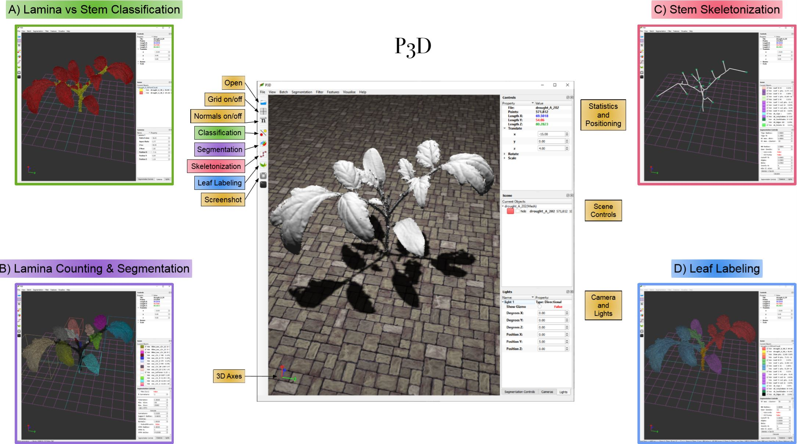
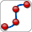
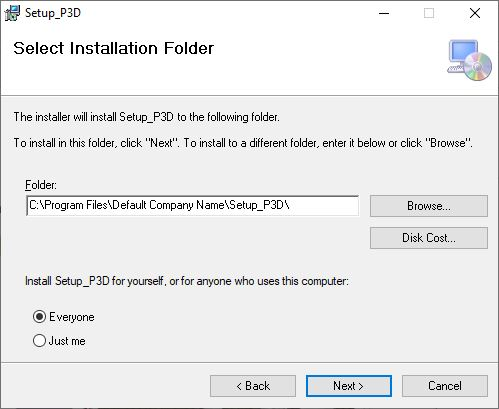

# P3D
Plant 3D (P3D): A plant phenotyping toolkit for 3D point clouds

<h2> Motivation</h2>

Developing methods to efficiently analyze 3D point cloud data of plant architectures remains challenging for many phenotyping applications. Here, we describe a tool that tackles four core phenotyping tasks: classification of cloud points into stem and lamina points; graph skeletonization of the stem points; segmentation of individual lamina; and whole leaf labeling. These four tasks are critical for numerous downstream phenotyping goals, such as quantifying plant biomass, performing morphological analyses of plant shapes, and uncovering genotype to phenotype relationships. The P3D tool provides an intuitive graphical user interface, a fast 3D rendering engine for visualizing plants with millions of cloud points, and several graph-theoretic and machine learning algorithms for 3D architecture analyses. As 3D point clouds become a standard data type for digitizing plant architectures in the lab and in the field, we hope the P3D tool can help accelerate next-generation plant phenotyping.



<h2> What is P3D?</h2>
  
Plant 3D (P3D) automatically extracts common phenotyping features of interest from high-resolution 3D scans of plant architectures. 
P3D is open-source and is bundled with a stand-alone Windows application. P3D is written in C++ using OpenGL, QT, TensorFlow, and the point cloud library (PCL). 
P3D can visualize and process data imported as a 3D point cloud (<TT>pcd</TT> or <TT>txt</TT> formats) or a mesh (<TT>obj</TT> format). 

<h3>The tool focuses on four phenotyping tasks</h3> 
<OL>
  <li>Lamina vs. stem classification</li>
  <li>Lamina counting and segmentation</li>
  <li>Stem skeletonization</li>
  <li>Whole leaf labeling</li>
</OL>

<!-- Classification ------------------------------------------------------------------------------------------------------->

<h3>  Lamina vs stem classification </h3>

Cloud points are classified by a trained deep learning model.
The model uses binary classification to separate lamina points (e.g., cotyledons, leaves) and stem points (e.g., branches, petioles).
Prior to training, a 33-dimensional feature vector was extracted for each 3D point. These features correspond to FPFH (Fast Point Feature Historgram) features, computed using the [Point Cloud Library](http://www.pointclouds.org/).
P3D comes with a few pre-trained models. Models can be found in TF_Models folder with __".pb"__ tensorflow file extension.
To use a model, click on the _classify_ button on the sidebar menu; controls panel on the lower right should appear. 
In the controls panel, click __Browse__ button to provide a path to __".pb"__ file and then click __Run Classification__.
For details on why FPFH was selected and what parameters were used for training, please refer to our publication (link below).

<!-- Segmentation -------------------------------------------------------------------------------------------------------->

<h3>  Lamina counting and segmentation</h3>

Lamina points are clustered into individual lamina. Clicking on the segmentaion icon on the sidebar menu will bring lamina segmentation controls panel on the lower right. The method is an enhanced version of conditional region growing.
To run lamina segmentaion on a user's file that has already been classified elsewhere and only contains lamina points (no stem points), a particular naming convetion must be followed (described below). 

<!-- Skeletonization -------------------------------------------------------------------------------------------------------->

<h3>  Stem skeletonization</h3>

Creates a graph-theoretic tree skeleton of the stem points. Our method is an improved version of the stem skeletanization of the [PypeTree framework](https://www.mdpi.com/1424-8220/14/3/4271). Stem file naming convetion needs to be followed to run this methods as well (described below).

<!-- Leaf labeling -------------------------------------------------------------------------------------------------------->

<h3>  Whole leaf labeling</h3>

Leaf labeling task consolidates the information gathered from lamina segmentation and skeletanization to produce a point cloud where
each point is labeled as one of the following: main stem, leaf in the biological sense, or cotyledon.
Currenlty this task in only available for tomato plants. 
To run this method, both the stem and lamina files need to named according to the naming convention (below) when imported to P3D.

<!-- Conventions -------------------------------------------------------------------------------------------------------->

<h3> Naming conventions </h3>
For the tasks to function properly a particular naming conventions need to be followed. 
All tasks except for classification expect this format.

```
plant_name_l.pcd or plant_name_l.txt  // "_l" stands for lamina points
plant_name_s.pcd or plant_name_s.txt  // "_s" stands for stem points
```

Running classification on any file will produce two sets of points; the names of these two files will automatically follow the expected convention.

<!-- Conventions -------------------------------------------------------------------------------------------------------->

<h3> Test Plant Point Clouds</h3>

The folder __"Plant_Point_Clouds"__ contains some raw (unclassified) scanned point clouds from our dataset in PCL's ".pcd" format. These can be used to test P3D.


<h2> How to use</h2>

Windows installer folder contains a msi installer file. Please donwload the file and run the executable wizard.

 

After the wizard is done, there should be two folders _P3D_ and _Assets_. Open _P3D_ folder and run the executable file located there. If you don't have access you a Windows computer, consider using a virual machine with a tool such as [virtual box](https://www.virtualbox.org/).

<!-- Models -------------------------------------------------------------------------------------------------------->
  
<h2> Models</h2>

The TF_Models folder contains deep learning models trained on our dataset using FPFH features. To use a model, supply a path to it during classification. For inference, P3D will compute FPHF features for every point using the same FPFH parameters used during training.
  
<h2> Publication </h2>

For aditional technical details, please refer to our publication below:

[_Machine Learning Approaches to Improve Three Basic Plant Phenotyping Tasks Using Three-Dimensional Point Clouds_](http://www.plantphysiol.org/content/181/4/1425)
